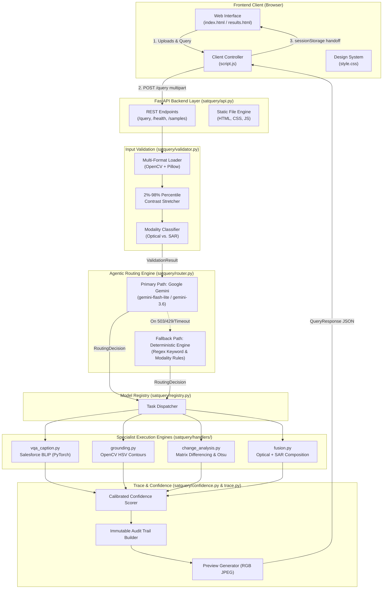

# SatQuery AI — System Architecture & Engineering Specification

SatQuery AI is an agentic vision-language assistant and controller backend for satellite imagery analysis. It receives single or multi-temporal satellite scenes (Optical, SAR, and GeoTIFF) alongside natural-language queries, orchestrates task selection via LLM function calling (Google Gemini or Anthropic Claude) with a deterministic fallback, dispatches work to specialized computer vision and neural handlers, and renders responsive visual bounding boxes with transparent execution traces in an integrated web frontend.

---

## 1. System Architecture Diagram



---

## 2. Directory Structure & Component Roles

```text
SAT/
├── .env                  # Private environment variables (GEMINI_API_KEY) — Git-ignored
├── .env.example          # Public template for environment configuration
├── .gitignore            # Excludes credentials, Python cache, and virtual environments
├── README.md             # Project overview, setup, and quick-start instructions
├── ARCHITECTURE.md       # Comprehensive technical and architectural specification
├── requirements.txt      # Dependency specification (PyTorch, Transformers, OpenCV, FastAPI, etc.)
│
├── index.html            # Upload interface (drag-and-drop slots, query input, agentic loading steps)
├── results.html          # Output display (visual evidence overlays, answer card, confidence, trace)
├── style.css             # Vanilla CSS design system (Navy/Blue/Purple palette, CSS grid, overlays)
├── script.js             # Client lifecycle: event listeners, API fetch, sessionStorage handoff
│
├── samples/              # Packaged demo imagery
│   ├── sample.tif        # 16-bit 3-channel optical GeoTIFF
│   ├── sample_single_optical.jpg # Standard RGB optical scene
│   ├── sample_before.jpg # Bi-temporal scene date 1
│   ├── sample_after.jpg  # Bi-temporal scene date 2
│   └── sample_sar.jpg    # Synthetic Aperture Radar (SAR) scene
│
├── satquery/             # Core Backend Engine
│   ├── __init__.py       # Package marker
│   ├── api.py            # FastAPI routes, pipeline orchestrator, preview generation
│   ├── models.py         # Pydantic models (ValidationResult, BoundingBox, ExecutionTrace, etc.)
│   ├── validator.py      # Format detection, 16-bit percentile stretching, modality heuristics
│   ├── router.py         # Gemini function-calling router with automated fallback rules
│   ├── registry.py       # Model dispatcher linking tasks to execution functions
│   ├── confidence.py     # Calibrated heuristic scoring per task
│   ├── trace.py          # Execution trace builder creating immutable audit records
│   └── handlers/         # Specialist Task Handlers
│       ├── __init__.py
│       ├── vqa_caption.py      # Salesforce BLIP vision-language captioning and VQA
│       ├── grounding.py        # Classical CV color-space & contour object localization
│       ├── change_analysis.py  # Bi-temporal matrix differencing & spatial cluster detection
│       └── fusion.py           # Optical + SAR dual-sensor composition
│
└── tests/                # Automated Test Suite (49 unit and integration tests)
    ├── test_api.py       # Endpoint verification, file serving, and upload format tests
    ├── test_validator.py # Modality detection, dimension checking, GeoTIFF ingestion
    ├── test_router.py    # Fallback rules, priority resolution, argument parsing
    └── test_handlers.py  # Computer vision, differencing, and BLIP inference tests
```

---

## 3. End-to-End Execution Lifecycle

```
[Browser Client]               [FastAPI Engine]             [Agentic Router]          [Specialist Handler]
       │                               │                           │                           │
       ├─── 1. POST /query ───────────▶│                           │                           │
       │    (Images + Query)           │                           │                           │
       │                               ├─── 2. Ingest & Stretch ──▶│                           │
       │                               │    (2%-98% Percentile)    │                           │
       │                               │                           │                           │
       │                               ├─── 3. Route Query ───────▶│                           │
       │                               │    (Gemini Tool-Calling)  │                           │
       │                               │◀── 4. Routing Decision ───┘                           │
       │                               │    (task + arguments)                                 │
       │                               │                                                       │
       │                               ├─── 5. Dispatch Task ─────────────────────────────────▶│
       │                               │    (Image Arrays + Args)                              │
       │                               │◀── 6. HandlerResult ──────────────────────────────────┘
       │                               │    (Answer + Bounding Boxes)                          │
       │                               │                                                       │
       │                               ├─── 7. Synthesize Trace, Normalize Coordinates         │
       │                               │       and Generate 24-bit RGB Base64 Previews         │
       │                               │                                                       │
       │◀── 8. QueryResponse JSON ─────┘                                                       │
       │                                                                                       │
       ├─── 9. Render Overlays, Answer Card, Confidence Meter, and Execution Trace             │
```

---

## 4. Deep Dive into Core Engineering Components

### 4.1. 16-Bit Satellite Dynamic Range Stretching (`satquery/validator.py`)
- **The Problem**: Satellite GeoTIFF sensors record raw physical reflectance in 16-bit unsigned integers (`uint16`, $0\text{–}65,535$). Ninety-nine percent of ground landscape features cluster in a lower radiometric band ($300\text{–}2,500$), while atmospheric glare or cloud reflections spike to $11,000+$. Linear min-max scaling compresses all terrain into the darkest $10\%$ of dynamic range, rendering images as muddy, monochromatic black.
- **The Solution**: Implementation of a per-channel **2%–98% cumulative percentile contrast stretch**:
  $$p_2, p_{98} = \text{Percentile}(C, [2, 98])$$
  $$C_{\text{stretched}} = \text{clip}\left(\frac{C - p_2}{p_{98} - p_2} \times 255, 0, 255\right)$$
- **Multi-Band Preservation**: For GeoTIFF files flagged with `PhotometricInterpretation = 1` (MinIsBlack), the loader utilizes OpenCV's `IMREAD_ANYDEPTH | IMREAD_COLOR` to prevent band-stripping, preserving all 3 optical channels and outputting full 24-bit RGB imagery.

### 4.2. Dual-Path Agentic Routing (`satquery/router.py`)
- **Primary LLM Path**: Uses Google Gemini function declarations (`vqa_caption`, `grounding`, `change_analysis`, `optical_sar_fusion`) with `function_calling_config: {"mode": "ANY"}`.
- **Automated Multi-Model Failover**:
  To protect against transient capacity limits (HTTP 503), deprecation (HTTP 404), or rate limits (HTTP 429), the router queries a prioritized model chain:
  1. `gemini-flash-lite-latest` (primary, low-latency, active)
  2. `gemini-3.6-flash` (latest generation fallback)
  3. `gemini-flash-latest` (legacy fallback)
- **Deterministic Keyword Fallback Path**:
  If offline or lacking credentials, the engine applies deterministic rules:
  1. Modality check: If inputs include both `optical` and `SAR` $\rightarrow$ `optical_sar_fusion`.
  2. Temporal regex: Queries containing terms like *change*, *differ*, *before and after* $\rightarrow$ `change_analysis`.
  3. Grounding regex: Queries containing *where*, *highlight*, *find*, *locate* $\rightarrow$ `grounding`.
  4. Default $\rightarrow$ `vqa_caption`.

### 4.3. Specialist Task Handlers (`satquery/handlers/`)
1. **Visual Question Answering (`vqa_caption.py`)**:
   - Model: Salesforce BLIP (`Salesforce/blip-image-captioning-base` and `Salesforce/blip-vqa-base`).
   - Framework: HuggingFace Transformers and PyTorch.
   - Converts imagery into Vision Transformer visual patch embeddings and generates natural-language answers via cross-attention.
2. **Spatial Grounding (`grounding.py`)**:
   - Color-Space Conversion: RGB $\rightarrow$ HSV (Hue, Saturation, Value).
   - Category Spectral Ranges: Calibrated masks for `water` (blue-cyan $H \in [90, 130]$), `vegetation` (chlorophyll green $H \in [35, 85]$), `urban`/`building` (low-saturation gray), and `sand` (high value, low saturation).
   - Contour Math: Extracts contiguous contours via `cv2.findContours` and calculates bounding boxes $[x, y, w, h]$.
3. **Bi-Temporal Change Detection (`change_analysis.py`)**:
   - Geometry matching and Gaussian noise reduction.
   - Pixel-wise matrix differencing: $\Delta(x, y) = |I_{\text{after}}(x, y) - I_{\text{before}}(x, y)|$.
   - Morphological filtering (ellipse kernel open/close) and Otsu thresholding.
   - Quantitative area calculation and quadrant spatial grouping.
4. **Optical + SAR Fusion (`fusion.py`)**:
   - Independent parallel evaluation across optical spectral variance and microwave backscatter reflectivity, composing a unified multi-modal report.

### 4.4. Trace Transparency & Calibrated Confidence (`satquery/confidence.py` & `trace.py`)
- Every execution produces an immutable `ExecutionTrace` recording:
  - `task_selected`: Task identified by the router.
  - `routing_path`: `llm_routed` vs. `fallback_routed` (with explicit fallback reason).
  - `model_called`: Specific model or algorithm executed.
  - `validator_output`: Modalities, formats, dimensions, and aspect ratio warnings.
  - `confidence` & `confidence_basis`: Calibrated score coupled with a plain-language explanation of its mathematical basis.

### 4.5. Frontend State Management & Overlay System (`script.js` & `style.css`)
- **Safe Session Storage**: To stay strictly within the browser's 5MB `sessionStorage` quota, original heavy multi-megabyte files are never persisted across tabs. Instead, the backend generates lightweight downsampled JPEG previews ($<150\text{ KB}$), ensuring reliable cross-page handoff.
- **Dynamic Evidence Overlays**:
  Bounding boxes use normalized coordinates ($x, y, \text{width}, \text{height} \in [0.0, 1.0]$). The frontend attaches an absolute-positioned overlay layer to the responsive `<figure>` element, dynamically scaling boxes via CSS percentages so they track image features on any screen size.

---

## 5. API Data Contracts

### 5.1. `POST /query`
- **Request**: Multipart Form Data
  - `image1` (File, required): Primary satellite image.
  - `image2` (File, optional): Secondary satellite image (required for change detection / fusion).
  - `query` (String, required): Natural-language question.

- **Response**: `QueryResponse` (JSON)
  ```json
  {
    "answer": "Detected 13 region(s) matching \"water body\" (water color range) via HSV thresholding.",
    "visual_evidence": {
      "type": "bounding_box",
      "boxes": [
        {
          "x": 0.4705,
          "y": 0.9421,
          "width": 0.0679,
          "height": 0.0579,
          "label": "water"
        }
      ]
    },
    "confidence": 0.74,
    "confidence_basis": "Classical CV color thresholding; 59.7% of image area matched (13 region(s) found)",
    "execution_trace": {
      "task_selected": "grounding",
      "routing_path": "llm_routed",
      "fallback_reason": null,
      "model_called": "OpenCV HSV Grounding Handler",
      "validator_output": {
        "image_count": 1,
        "modalities": ["optical"],
        "formats": ["GeoTIFF"],
        "dimensions": [[1001, 1001]],
        "warnings": [],
        "is_valid": true
      },
      "parameters_used": {
        "target_object": "water body"
      },
      "timestamp": "2026-09-18T06:50:00Z"
    },
    "image_previews": [
      "data:image/jpeg;base64,..."
    ]
  }
  ```

---

## 6. Verification and Test Coverage

The system is validated through an automated test suite of **49 test cases** executed via `pytest`:

| Test Module | Coverage Area | Status |
| :--- | :--- | :--- |
| `tests/test_api.py` | Health endpoints, static file delivery, form uploads, GeoTIFF ingestion | **8 / 8 Passed** |
| `tests/test_validator.py` | Modality classification (optical vs SAR), aspect ratio checks, bounds | **13 / 13 Passed** |
| `tests/test_router.py` | Deterministic fallback priority, keyword triggers, parameter extraction | **10 / 10 Passed** |
| `tests/test_handlers.py` | BLIP VQA/captioning, CV grounding, matrix differencing, multi-modal fusion | **18 / 18 Passed** |
| **Total** | Full end-to-end integration and unit verification | **49 / 49 Passed (100%)** |
